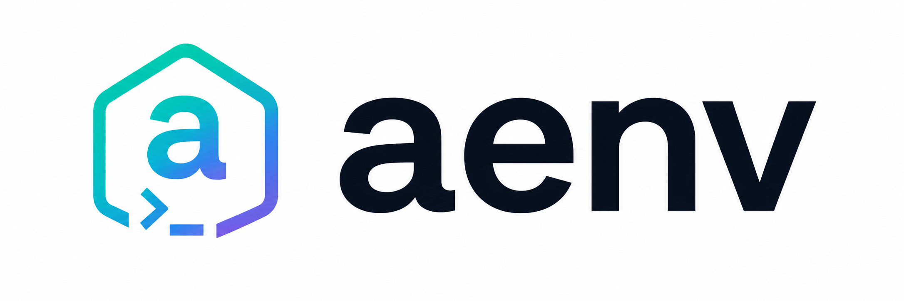

<p align="center">
  
</p>

<h1 align="center">aenv</h1>

<p align="center">
  <b>Per-environment isolation for AI coding CLIs — <a href="https://docs.anthropic.com/en/docs/claude-code">Claude Code</a>, <a href="https://github.com/openai/codex">Codex</a>, and more — with plugins, skills, MCPs, and secrets.</b>
  <br/>
  <sub>Reproducible, declarative, team-shareable. Like <code>venv</code> for Python or <code>rustup</code> for Rust — but for your AI agent stack.</sub>
</p>

<p align="center">
  <a href="#license"></a>
  <a href="https://www.rust-lang.org"></a>
  <a href="#status"></a>
  <a href="#status"></a>
  <a href="#platform-support"></a>
</p>

<p align="center">
  <a href="#installation">Install</a> &#8226;
  <a href="#quick-start">Quick Start</a> &#8226;
  <a href="#commands">Commands</a> &#8226;
  <a href="#how-it-works">How It Works</a> &#8226;
  <a href="#comparison">Comparison</a> &#8226;
  <a href="#security-model">Security</a>
</p>

---

## Why aenv?

Every AI coding CLI — Claude Code, Codex, Cursor, Gemini — stores everything in a single global directory: `~/.claude/`, `~/.codex/`, `~/.cursor/`, `~/.gemini/`. As you start using these tools seriously, that single directory becomes a liability:

- You want to **try a risky plugin** (or a sketchy MCP) without polluting your main setup.
- Your **work** project has strict MCP allowlists; your **side project** needs an experimental sandbox.
- You're **building an AI agent** and need pinned plugin versions so production runs are reproducible.
- Your **team** wants a known-good baseline that everyone gets identically — not a wiki page that says "install these 7 things".
- You want **the same env switcher across tools**, not one ad-hoc script per CLI.

`aenv` solves all of these by treating each AI-CLI config as a first-class, isolated, reproducible environment — declared in `aenv.toml`, locked by `aenv.lock`, committed to git. **Backends shipped today: Claude Code + Codex.** Each backend uses the tool's *native* config-dir env var (`CLAUDE_CONFIG_DIR`, `CODEX_HOME`, ...) so isolation is real, not a wrapper trick.

```sh
aenv new my-project          # isolated env
aenv use my-project          # pin to cwd + activate in this shell
claude                       # auto-routes through shim → my-project's config
```

Switching projects switches plugins, skills, MCPs, hooks, and even MCP secrets. Your teammate clones the repo, runs `aenv install`, gets the same setup.

### Why not just rely on each tool's native config dir?

Each AI CLI does ship some env-var to redirect its config (`CLAUDE_CONFIG_DIR`, `CODEX_HOME`, ...). You *can* manually shell-script around them. But:

- **You still need a manifest.** Just setting `CODEX_HOME=$PWD/codex` doesn't pin which MCPs / plugins / skills / secrets the env should have. `aenv.toml` + `aenv.lock` give you reproducible installs across machines and teammates — the same gap `venv`-style isolation closes for Python deps, but at the agent-config layer.
- **You still need secrets out of the manifest.** Plain shell scripts encourage hard-coded API keys in env-files committed to git. aenv keeps secrets in the OS keyring and lets the manifest ship `${secret:KEY}` references, resolved at launch.
- **You still need preflight gating.** Hooks (`[hooks].pre_activate`) refuse the env when prerequisites aren't met (token missing, wrong branch, network down) — the user gets a clear "won't launch" instead of a half-broken claude session.
- **You still need an escape hatch.** `global` aliases the user's real `~/.claude` / `~/.codex` and is always present, so any pin / hook / broken env can be bypassed with `aenv quit` and a relaunch.
- **You want one tool, not five.** A bash function for codex + a wrapper for claude + a separate config script for cursor — each with its own bugs, edge cases, and stale assumptions — is exactly what `aenv` replaces. The universal core (manifest, lockfile, store, secrets, txn, audit) lives once; per-tool shims stay in `src/backend/<id>/`.

Both shipped backends collapse to a single env-var redirect plus exec — no supervisor restart loop, no overlay scraping. A future Claude Code or Codex change touches only its backend module.

---

## Highlights

| | |
|---|---|
| 🧱 **Real per-env isolation, single env-var redirect** | `CLAUDE_CONFIG_DIR=<env>/.claude` (claude) / `CODEX_HOME=<env>/codex` (codex) — auth, sessions, plugins, MCPs, `enabledPlugins`, plugin cache all follow it natively. No supervisor restart loop, no overlay scraping, no `--strict-mcp-config` plumbing. Verified against Claude Code 2.1.138's resolver. |
| 📦 **Declarative + reproducible** | `aenv.toml` (intent) + content-hashed `aenv.lock` (frozen state). Commit both — teammates get bit-identical envs |
| 🔐 **Secrets in OS keyring** | `${secret:KEY}` references in manifest. Plaintext never hits disk in `aenv.toml` or `settings.json`; the shim resolves keys at launch and exports them as env vars |
| 🤝 **Team-shareable** | `aenv export-profile` / `import-profile` bundles. Hooks stripped on import (RCE protection) |
| ⚡ **Disk-efficient** | Content-addressed plugin/skill store with hardlink fanout — same plugin shared across envs by inode |
| 🔄 **Transactional** | Every mutating op auto-snapshots → `aenv rollback` (or `--pending` after a kill) |
| 🔑 **Per-env auth** | Each env's keychain entry / `auth.json` is independent — one `/login` per env, never refreshed unexpectedly. Trade-off for real isolation; symmetric across both claude and codex |
| 🛡️ **Hardened** | 0700/0600 perms, atomic writes, Zip Slip-safe tar extraction, path-traversal validation |
| 🔌 **`claude mcp add`-compatible** | Same flag grammar, plus `--from claude-desktop`/`cursor`/`vscode-deeplink:` bulk import |

---

## Installation

> **Not on crates.io yet** (pre-1.0 stabilization). Install from the GitHub source:

```sh
cargo install --git https://github.com/wnsdy95/aenv --locked
```

`cargo install aenv` (no `--git`) will fail with `could not find aenv in registry` until the first crates.io release. Once that lands, this section will show the shorter form.

This drops the binary at `~/.cargo/bin/aenv`. Make sure `~/.cargo/bin` is on your `PATH` (default for a standard Rust install).

Requires Rust **1.88+**.

> **Don't manually copy the binary to `~/.local/bin` or `/usr/local/bin`.**
> The `aenv upgrade` flow re-runs `cargo install` and writes back to `~/.cargo/bin` — a stale copy higher in `PATH` would silently shadow every upgrade. If you previously copied the binary, delete that copy.

## Upgrade

```sh
aenv upgrade
```

Pulls the latest source, rebuilds the binary, refreshes the shim. Does **not** auto-detect or self-heal — upgrades only happen when you explicitly opt in, so a new release never surprises you mid-task.

### Local clone (developing aenv or testing a patch)

When working from a checkout of this repo (rather than from `cargo install --git`), one line does build + path refresh + in-place reload:

```sh
cargo install --path . --force --locked && hash -r && eval "$(~/.cargo/bin/aenv shell-init zsh)"
```

Step by step:

| Command | What it does |
|---|---|
| `cargo install --path . --force --locked` | Builds the working tree and overwrites `~/.cargo/bin/aenv` |
| `hash -r` | Drops the shell's command-path cache so the next `aenv` / `claude` lookup finds the freshly-installed binary |
| `eval "$(~/.cargo/bin/aenv shell-init zsh)"` | Re-evaluates the new shell-init script in this shell — picks up updated `aenv` / `_aenv_prompt` functions and any PATH changes without opening a new terminal |

For bash or fish, replace the trailing `zsh` accordingly. The `~/.cargo/bin/aenv` absolute path matters in step 3 — without it, the still-cached old `aenv` could emit the stale init script before `hash -r` takes effect.

---

## Quick Start

```sh
# 1. One-time setup (creates 'default' env seeded from your existing ~/.claude)
aenv init

# 2. Wire your shell — pick the line for your shell, run once
echo 'eval "$(aenv shell-init zsh)"'  >> ~/.zshrc       # zsh (macOS default)
echo 'eval "$(aenv shell-init bash)"' >> ~/.bashrc      # bash / Git Bash on Windows
echo 'aenv shell-init fish | source'  >> ~/.config/fish/config.fish

# Then either reload (`source ~/.zshrc`) or open a new terminal.

# 3. In any project — create an env and pin it to the directory
aenv new my-project
aenv use my-project    # writes .aenv-version in cwd AND sets $AENV in this shell

# 4. Just run claude — the shim routes CLAUDE_CONFIG_DIR into the env
claude
# First time inside the env: run /login once. The keychain entry stays
# put across restarts; subsequent claude launches use it without prompts.
```

That's it. Run `aenv current` from another shell to confirm the active env. To switch envs inside an existing claude session, run `aenv use <name>` in a side terminal, then exit the current claude (`/quit` or Ctrl-D) and relaunch — the shim picks up the new pin on the next exec.

### Reproducible team setup

```sh
# Owner — declare what the project needs
aenv init --here my-project          # writes aenv.toml + aenv.lock to cwd
aenv add mcp github -- npx -y @modelcontextprotocol/server-github
aenv add plugin engineering@1.4.0 --source npm:@anthropic/engineering-plugin@1.4.0
# Marketplace-style repos with many plugins can point at the plugin subdir.
aenv add plugin code-review \
  --source git+https://github.com/anthropics/claude-plugins-official \
  --subpath plugins/code-review
aenv secrets add gh-token            # stored in OS keyring
git add aenv.toml aenv.lock

# Teammate — clone, install, add their own secrets
aenv install
aenv secrets add gh-token            # their own token, in their keyring
```

---

## Commands

### Lifecycle

| Command | What happens | When to use |
|---------|-------------|-------------|
| `aenv init [--no-default]` | Installs the shim, creates the `default` env from `~/.claude` if present | **First time only.** One command, original `~/.claude` is preserved |
| `aenv init --here [<name>]` | Initializes a **project-local** env in cwd (writes `aenv.toml` + `aenv.lock`) | When you want the manifest committable to git |
| `aenv new <name> [--from <src>] [--bare] [--ifl]` | Creates a fresh env, optionally cloned from another. `--ifl` opens the import TUI immediately | Spinning up a new persona / project / experiment |
| `aenv use <name> [--global]` | Writes the cwd `.aenv-version` pin (or global default with `--global`) AND activates the env in this shell (`unset AENV_OVERRIDE` + `export AENV="<name>"`) — see `[name]` in your prompt | Day-to-day project switching |
| `aenv quit` | venv-`deactivate` UX: this shell becomes env-less *visually and behaviorally*. `unset AENV` + `export AENV_OVERRIDE=global` shadows any cwd `.aenv-version` / `aenv.toml` for this shell only (disk pin untouched). Prompt loses the `[name] ` tag, and `claude` / `codex` run against the user's real `~/.claude` / `~/.codex` | Alias `aenv deactivate`. New shell or `aenv use <name>` re-engages the disk pin |
| `aenv current [--explain]` | Prints the active env name. `--explain` shows the resolution chain | Debugging "which env am I in?" |
| `aenv list [-l]` | Lists all envs. `*` = active, `!` = broken (missing/invalid manifest) | Inventory |
| `aenv remove <name> [--force]` | Deletes an env (refuses if active without `--force`) | Cleanup |
| `aenv import-global <name> [--force] [--set-default]` | Copies your live `~/.claude` into a named env | Bootstrapping from an existing setup |

### Declarative — manifest & lockfile

| Command | What happens |
|---------|-------------|
| `aenv add mcp <name> [-- <cmd>...]` | Add an MCP server. Supports `--transport stdio\|http\|sse`, `--json`, `--from claude-desktop\|cursor\|cursor-deeplink:<url>\|vscode-deeplink:<url>\|<path>` (bulk import) |
| `aenv add plugin <name>[@<ver>] --source <src> [--subpath <path>]` | Add a plugin. `--subpath` selects a plugin inside a marketplace-style repo |
| `aenv add skill <name> --source <src>` | Add a skill |
| `aenv rm mcp\|plugin\|skill <name>` | Remove from manifest and immediately prune from the lockfile, on-disk fanout, and native JSON (same `tx::with_tx` envelope as the manifest save — atomic) |
| `aenv install [--no-lock]` | Explicit reproduce/re-apply step from manifest + lockfile. Useful after clone or when sharing an env; day-to-day `aenv add` / `aenv rm` / `aenv ifl` apply their changes immediately so this is a publish/repair command, not a routine one |
| `aenv lock` | Re-generate `aenv.lock` from manifest without applying |
| `aenv sync` | Re-materialize the env from `aenv.lock` exactly (no fetching). Ad-hoc `/mcp add` and `/plugin install` entries the user added inside claude are preserved via the `_aenv: true` tagging — sync only touches rows aenv owns |
| `aenv ifl [--from <env> --plugin <name> ...]` | **Bidirectional import / unpin:** interactive TUI. Items already in the target are pre-checked with a dim `(in target)` marker; unchecking them removes the entry from the manifest at submit. On submit, aenv immediately materializes plugins/skills and renders MCP settings, so the next `claude` launch sees the change without a manual `aenv install`. Non-interactive `--from` form is add-only — removal there routes through `aenv rm <kind> <name>` (explicit destructive). Includes a synthesized `(global)` source that mirrors your `~/.claude/` and `~/.codex/skills`. Pair with `aenv new <name> --ifl` to create + populate in one step |

### Sources

| Source | Example |
|---|---|
| `npm:` | `npm:@anthropic/engineering-plugin@1.4.0` |
| `git+https://` | `git+https://github.com/me/skills@main` |
| Git repo subdir | `--source git+https://github.com/anthropics/claude-plugins-official --subpath plugins/code-review` |
| Tarball over HTTPS | `https://example.com/plugin.tar.gz` |
| Local | `file:///abs/path` or any local path (dir or tarball) |

### Secrets (OS keyring)

| Command | What happens |
|---------|-------------|
| `aenv secrets add <key> [--value <v>]` | Stores a secret in the OS keyring (prompts on stdin if `--value` omitted) |
| `aenv secrets list` | Lists keys only — values are **never** displayed |
| `aenv secrets rm <key>` | Removes a secret |
| `aenv secrets rotate <key>` | Replaces the value of an existing secret |

### Sharing

| Command | What happens |
|---------|-------------|
| `aenv export-profile [-o <file>]` | Bundles the env (excludes secrets, sessions, cache) as `.aenv.tar.gz` |
| `aenv import-profile <file> [--name <new>] [--force] [--trust-hooks]` | Imports a bundle. Hooks are **stripped by default** (RCE protection); `--trust-hooks` to keep |

### Transactions & history

| Command | What happens |
|---------|-------------|
| `aenv rollback [--pending]` | Restores the most recent committed transaction. `--pending` recovers from a process killed mid-install |
| `aenv history [--limit N]` | Lists transactions newest-first |
| `aenv prune [--keep-count N] [--keep-days D]` | Deletes old snapshots |
| `aenv audit [--limit N] [--json]` | Append-only operation log |

### Operations

| Command | What happens |
|---------|-------------|
| `aenv exec [-E <env>] -- <cmd>...` | Runs a command (or child claude) inside an env's context, **without switching** the active env |
| `aenv upgrade [--dry-run]` | Rebuilds the binary via `cargo install --git`, then refreshes the shim using the new binary so both artifacts move in lockstep |
| `aenv doctor [<env>] [--json]` | Health checks: shim install, PATH order, compat semver, pending txns, managed-vs-user plugin counts, cross-platform sharing checks (autocrlf, `.gitattributes`, manifest portability) |
| `aenv status [-E <env>] [--json]` | Detailed env status (plugins, MCPs, paths) |
| `aenv which env <name>\|claude\|codex\|shim\|home` | Resolve a path |
| `aenv shell-init bash\|zsh\|fish` | Prints the shell init script. Refuses to emit if `AENV_HOME` contains shell metacharacters |

---

## How It Works

### The shim model

```
$PATH lookup of `claude`
        │
        ▼
~/.aenv/shims/claude  ─────►  aenv binary  ─────►  backend::claude::shim::run
        │
        ▼
resolve active env from precedence:
  1. $AENV_OVERRIDE
  2. $AENV
  3. aenv.toml walk-up (project mode)
  4. .aenv-version walk-up from cwd
  5. global default in ~/.aenv/config.toml
        │
        ▼
exec real claude with
  CLAUDE_CONFIG_DIR  = <env_root>/.claude       (claude routes here)
  XDG_{CONFIG,DATA,STATE,CACHE}_HOME = <env>/xdg/...
  AENV, AENV_ACTIVE  = <env_name>               (breadcrumbs)
  AENV_<env>_<KEY>   = <keyring value>          (one per ${secret:KEY} in manifest)
```

**Single env-var redirect** — `CLAUDE_CONFIG_DIR` is the entire isolation contract. Verified against Claude Code 2.1.138 (the bundled JS resolves config root via `process.env.CLAUDE_CONFIG_DIR ?? path.join(homedir(), ".claude")` and every downstream path is `path.join(configRoot, …)`). Plugins, sessions, `installed_plugins.json`, the plugin cache, the macOS Keychain hash, MCP config — all follow the env-var.

Codex follows the same pattern with `CODEX_HOME`. No supervisor restart loop, no overlay scraping, no `--strict-mcp-config` plumbing. The shim is `exec(claude, ...)` after env-var setup; tests (`tests/cli.rs::claude_shim_routes_config_dir_into_active_env`) pin this contract.

### Plugin isolation

Each env has its own `<env>/.claude/plugins/`, its own `installed_plugins.json`, its own `enabledPlugins`. `/plugin install foo` from inside an active env writes to that env's directories only — other envs are untouched. No shared cache, no overlay toggle.

Manifest-pinned plugins are wired in by aenv writing `installed_plugins.json` directly — every mutator (`aenv add`, `aenv rm`, `aenv ifl`, and the explicit `aenv install`) applies its change to the env immediately, no separate materialize step. Verified against Claude Code 2.1.138's resolver, which reads that file as the single source of truth (no directory walk). Each entry is tagged `_aenv: true` so prune can clean only what aenv put there, never the user's `/plugin install` additions. `aenv status` splits the two: `pinned` from `aenv.toml` (reproducible), `ad-hoc` from `installed_plugins.json` (env-local, won't survive a teammate's `aenv install` — promote with `aenv ifl` if intended). `aenv doctor` surfaces drift between the two.

### Auth model

Each env's macOS Keychain service name is hashed from `CLAUDE_CONFIG_DIR`, so **every env has its own login**. First launch in a new env: run `/login` once. The token persists across `claude` restarts under that env; you never re-login unless you delete the env. Same shape Codex has with `CODEX_HOME`. This is the cost of real isolation — accepted as a trade-off for a clean, single-mechanism design.

### Switching envs from inside an active session

The new shim is single-exec — there's no supervisor watching for an exit-code-75 restart marker, so `/aenv:reload` and `/aenv:use` slash commands no longer ship. Workflow:

```sh
# In a side terminal
aenv use other-env

# In the active claude session
/quit       # or Ctrl-D

# Relaunch — shim resolves the new pin and routes CLAUDE_CONFIG_DIR there
claude
```

Codex follows the same pattern. If you want auto-resume on the next claude launch, add `--resume <session-id>` yourself — the conversation log still lives at `<old-env>/.claude/projects/...`, so resumes are env-bound by construction.

### How secrets reach MCP servers (no plaintext on disk)

```
aenv.toml                              ← source of truth (committed to git)
  [mcp.github]
  env = { GITHUB_TOKEN = "${secret:gh-token}" }
       │
       ▼ aenv install
.claude/settings.json                  ← rewritten reference
  "mcpServers": {"github": {
    "env": {"GITHUB_TOKEN": "${AENV_FULLSTACK_GH_TOKEN}"}
  }}
       │
       ▼ shim at launch (claude or aenv exec / aenv run)
process env                            ← claude inherits, MCP launched with it
  AENV_FULLSTACK_GH_TOKEN=<value-from-keyring>
       │
       ▼ claude substitutes
MCP server                             ← gets resolved GITHUB_TOKEN=<value>
```

`aenv.toml` and `settings.json` both hold env-var references only. Plaintext exists only in the **OS keyring** and ephemerally in the **shim's child process env** (set right before `exec`, never written to disk).

### How `aenv quit` works (venv `deactivate` parity)

`aenv quit` (alias `aenv deactivate`) makes the current shell behave as if aenv weren't installed — but only for that shell. Same shape Python's `deactivate` has:

```
$ aenv use my-project
[my-project] $ claude          # CLAUDE_CONFIG_DIR=<env>/.claude
[my-project] $ aenv quit       # shell function: unset AENV; export AENV_OVERRIDE=global
$ claude                       # CLAUDE_CONFIG_DIR unset → user's real ~/.claude
$ aenv use my-project          # shell function: unset AENV_OVERRIDE; export AENV=my-project
[my-project] $
```

Two layers stay separate by design:

| Layer | Lives in | Persistence | Touched by |
|---|---|---|---|
| **Disk pin** (`.aenv-version` / `aenv.toml`) | Project tree | Permanent, git-shareable | `aenv use`, manual edits |
| **Shell override** (`$AENV` / `$AENV_OVERRIDE`) | Process env | Until shell exits | `aenv use`, `aenv quit` |

`aenv quit` only flips the shell layer — it never deletes a `.aenv-version` because that file may be a teammate-shared project pin. To genuinely drop the disk pin, `rm .aenv-version`. The `_aenv_prompt` precmd hook treats `current=global` as "no tag", so the prompt loses the `[name] ` segment exactly when you'd expect it to in venv. The CLI's banner suppression matches.

### How `aenv ifl` is bidirectional

`aenv ifl` is the canonical UX for moving manifest entries between envs. The TUI lists every other env (plus a synthesized `(global)` source that aggregates the user's pre-aenv config: plugins from `~/.claude/plugins/installed_plugins.json` (with `installPath` fallback for non-github marketplaces), MCPs from both `~/.claude/settings.json` and legacy `~/.claude.json`, and skills from `~/.claude/skills/`, `~/.claude/plugins/**/skills/`, `~/.codex/skills/` and `~/.codex/plugins/**/skills/`) and lets you check items to import:

```
   default   · 0 selected
   work      · 0 selected
 ▸ play      · 2 selected
   (global)  · 0 selected
   [submit]
```

Drilling into a source shows its plugins / skills / MCPs. Two contracts that distinguish ifl from a one-shot importer:

1. **Items already pinned in the target are pre-checked** with a dim `(in target)` marker. Round-tripping (= leaving everything as-is and submitting) is a no-op — the manifest doesn't churn just because you opened the TUI. Same items aren't re-added.

2. **Unchecking a pre-checked row removes the entry from the target's manifest.** Toggle is global across sources for items in the target — flipping `[x] github (in target)` once in *any* source detail screen propagates to every other source row carrying the same name, so a single uncheck always means "drop from target". Without this, a shared MCP that lives in two source envs couldn't be unpinned from one screen.

The non-interactive form (`aenv ifl --from <env> --plugin <name>`) stays add-only by design; removal there routes through `aenv rm <kind> <name>`, which has stronger argument validation. **Target-only items** — pins that live only in the target's manifest and don't appear in any source — are never removable through ifl (they don't render anywhere), so submitting can never silently drop them. `aenv rm` is the only path.

### How aenv preserves ad-hoc additions

Two layers stay independent by design — manifest is for *intentional, shared* spec, runtime state is for *what claude actually has loaded right now*:

| | Written by | Lives in | Role |
|---|---|---|---|
| **`aenv.toml`** | You explicitly (`aenv add` / `aenv ifl`) | Project / env root | The shared, reproducible set teammates get from `aenv install` |
| **`installed_plugins.json`, `settings.json`** | Claude Code at runtime, plus aenv on apply | `<env>/.claude/` | Env-local state; ad-hoc `/plugin install` and `/mcp add` land here directly |

aenv never clobbers ad-hoc entries. Every row aenv writes (in `installed_plugins.json::plugins`, in `settings.json::mcpServers`, etc.) carries an `_aenv: true` flag inside the entry's metadata. On the next mutator (whether that's `aenv add`, `aenv install`, `aenv ifl`), aenv:

- **refreshes** rows tagged `_aenv: true` from the current manifest,
- **drops** tagged rows that fell out of the manifest (`aenv rm`),
- **leaves untagged rows untouched, byte-identically**.

So `/mcp add notion` inside claude survives every `aenv add`/`install`/`sync`/`ifl`. `aenv doctor` surfaces ad-hoc entries as a friendly hint — "these won't reproduce on a teammate's `aenv install`; promote with `aenv ifl` if intended" — never as a refusal. There's no `--force` flag because there's nothing to opt out of.

If a name collides (you `/mcp add github` inside claude and also `aenv add mcp github` from outside), the manifest entry wins on the next apply — otherwise reproducibility breaks. Promote-then-add or accept the override.

---

## `aenv.toml` example

```toml
aenv_schema_version = "2"

[env]
name = "fullstack"
description = "GitHub MCP + engineering plugin, shared across claude + codex"

# Per-backend version range — warns at `aenv doctor` if mismatched.
# Each backend has its own range; omit a backend to skip the check.
[env.compat]
claude = ">=2.1, <3"
codex  = ">=0.7"

[mcp.github]
# Shared by every backend that consumes [mcp.*] (claude + codex today).
command = "npx"
args = ["-y", "@modelcontextprotocol/server-github"]
# ${secret:KEY}  → claude: looked up in OS keyring, exported at launch.
#                  codex:  passes through verbatim into config.toml in 0.3.0;
#                          set AENV_<env>_<KEY> manually if needed.
# ${env:VAR}     → inherited from caller's shell
# literal text   → kept as-is
env = { GITHUB_TOKEN = "${secret:gh-token}" }

[[plugins.enabled]]
# Plugins / skills are claude-specific in 0.3.0 — the codex backend
# silently skips them at install time.
name = "engineering"
version = "1.4.0"
source = "npm:@anthropic/engineering-plugin@1.4.0"

[[skills.enabled]]
name = "code-review-strict"
source = "git+https://github.com/me/skills@main"

[hooks]
# Shell command run before each claude launch in this env.
# Stripped on `import-profile` unless --trust-hooks is passed (RCE protection).
pre_activate = "echo activating fullstack >&2"
```

---

## Layout

```
~/.aenv/                                  # 0700, owner-only
├── config.toml                           # global default, real-claude cache
├── .lock                                 # mutating-op flock
├── envs/                                 # 0700
│   ├── <name>/                           #         global named env
│   └── <name>-<sha8>/                    #         project-mode slot (hashed)
│       ├── aenv.toml                     # global mode: source of truth
│       ├── aenv.lock                     # global mode: content hashes
│       ├── .aenv-project-source          # project mode: → ./aenv.toml
│       ├── .claude/
│       │   ├── settings.json             # 0600 — rendered mcpServers + enabledPlugins
│       │   ├── plugins/
│       │   │   ├── installed_plugins.json   # native discovery (schema v2)
│       │   │   ├── known_marketplaces.json  # github/url source registry
│       │   │   └── <name@mkt>/<sha>/        # store hardlinks (installPath target)
│       │   └── skills/                   # auto-generated wrapper plugins (also in installed_plugins.json under aenv-skills mkt)
│       ├── xdg/{config,data,state,cache}/
│       └── .secrets.list                 # 0600 — secret-key index
├── store/objects/<sha[..2]>/<sha>/       # content-addressed
├── state/<iso-timestamp>/                # transaction snapshots
│   └── manifest.json                     # status: Pending/Committed/RolledBack
├── audit.jsonl                           # mutating-op log (append-only)
└── shims/                                # one symlink per registered backend
    ├── claude                            # → aenv binary
    └── codex                             # → aenv binary (only if codex on PATH at init)

# Per-env tool dirs (created by Env::create alongside .claude/)
~/.aenv/envs/<name>/
├── .claude/                              # claude's CLAUDE_CONFIG_DIR
└── codex/                                # codex's CODEX_HOME
    └── config.toml                       # mcp_servers.* rendered from [mcp.*]

# Project-mode (committed to git)
<project>/
├── aenv.toml                             # source of truth
├── aenv.lock                             # source of truth
└── .gitattributes                        # `aenv.{toml,lock} -text` (auto-generated)
```

---

## Comparison

How `aenv` compares to other Claude Code config managers:

| Feature | **aenv** | [clenv](https://github.com/Imchaemin/clenv) | [ccp](https://github.com/HaloXie/claude-code-profile) | [clausona](https://github.com/larcane97/clausona) | [cce](https://github.com/cexll/claude-code-env) |
|---|:---:|:---:|:---:|:---:|:---:|
| Language | Rust | Rust | TS | TS | Go |
| Per-env `~/.claude` isolation | ✅ | ✅ | ✅ | ⚠️ shared by default | ❌ env-vars only |
| Per-directory pin (`.aenv-version` / `.clenvrc`) | ✅ | ✅ | ❌ | ❌ | ❌ |
| **Declarative manifest + content-hashed lockfile** | ✅ | ❌ | ❌ | ❌ | ❌ |
| **Reproducible install from manifest** (`aenv install`) | ✅ | ❌ | ❌ | ❌ | ❌ |
| Plugin/skill source resolver (npm/git/https/local) | ✅ | ❌ | ❌ | ❌ | ❌ |
| **OS keyring secrets** (`${secret:K}` references) | ✅ | ❌ | ❌ | ❌ | ⚠️ on-disk |
| Disk-efficient shared store | ✅ hardlinks | ❌ | ✅ symlinks | ✅ symlinks | ❌ |
| Version control / snapshot rollback | ✅ txn | ✅ git | ✅ git | ❌ | ❌ |
| Bundle export/import (with hook RCE strip) | ✅ | ✅ | ✅ | ❌ | ❌ |
| Pre-launch `[hooks].pre_activate` (exit-code-gated) | ✅ | ❌ | ❌ | ❌ | ❌ |
| Reserved `global` escape-hatch env (always present) | ✅ | ❌ | ❌ | ❌ | ❌ |
| `claude mcp add`-compatible grammar | ✅ | ❌ | ❌ | ❌ | ❌ |
| Bulk MCP import (Cursor / Claude Desktop / VS Code deeplink) | ✅ | ❌ | ❌ | ❌ | ❌ |
| Tar Zip-Slip / symlink attack defense | ✅ | ❓ | ❓ | ❓ | ❓ |

`aenv` is the most **reproducibility- and security-focused** option. If you only need to switch accounts, [clausona](https://github.com/larcane97/clausona) or [ccp](https://github.com/HaloXie/claude-code-profile) are simpler. If you need to **commit a manifest to git so your team gets identical setups**, `aenv` is the only choice.

---

## Security Model

| Threat | Mitigation |
|---|---|
| Plugin visibility leak across envs | Each env has its own `<env>/.claude/plugins/` and `installed_plugins.json` (the `CLAUDE_CONFIG_DIR` redirect routes the whole config root, plugin cache included). `/plugin install foo` from env A writes only to env A; env B sees nothing of it |
| Path traversal in plugin/skill/mcp names | Resource-name validation at CLI input AND manifest load (`[a-zA-Z0-9._-]+`, no leading dot) |
| Tar Zip Slip / symlink attack | `unpack_safe`: skip non-regular entries, reject `..`/absolute paths, `target.starts_with(dst)` final check |
| Hook RCE via shared bundle | `import-profile` strips `hooks.pre_activate` by default; `--trust-hooks` to keep |
| Shell-init injection via `AENV_HOME` path | Refuses paths with shell metacharacters (`"'`$\\`); emits `return 1` on unsafe |
| Plaintext secrets on disk | `aenv.toml` holds only `${secret:K}` refs; `settings.json` holds only `${AENV_X_Y}` env-var refs; plaintext only in the OS keyring and ephemerally in the shim's child env (set right before `exec`, never written to disk) |
| `export-profile` accidentally archiving `$HOME` | The reserved `global` env (alias for `~/.claude`) is rejected by `export-profile` before any disk walk — its `root` is `$HOME`, so a naive walker would tar up the entire home directory |
| Manifest mutation against the user's real config | `aenv add` / `install` / `lock` / `sync` / `rm` / `secrets *` all refuse the reserved `global` env with a "no aenv.toml to mutate" error |
| Multi-user info leak | `~/.aenv/` 0700, env dirs 0700, `settings.json` + `.secrets.list` 0600 (best-effort: chmod-respecting FS only) |
| Non-atomic write corruption on SIGKILL | All critical writes go through `paths::write_atomic` (temp+fsync+rename) |
| Concurrent operation races | Global flock at `~/.aenv/.lock`; non-blocking try first with "waiting…" message |
| Killed mid-install limbo | `aenv rollback --pending` recovers; `aenv doctor` surfaces pending txns |
| User locked out by hook / broken pin / corrupted manifest | Reserved `global` env is the universal escape hatch — `aenv quit` always falls through to it, restoring the user's real `~/.claude` / `~/.codex` exactly as if aenv weren't installed |

---

## Architecture

Single layer — a Rust binary that acts as both `aenv <subcommand>` and as the per-tool shim (`claude`, `codex`) via argv[0] dispatch.

### Shim path (the hot path)
`PATH` lookup of `claude` resolves to `~/.aenv/shims/claude` → the aenv binary inspects `argv[0]`, picks the matching backend, runs `shim::run`:
1. Resolve the active env (override → AENV → aenv.toml → .aenv-version → default_env → reserved `global`).
2. Locate the real claude / codex binary on PATH.
3. Set per-env env-vars (`CLAUDE_CONFIG_DIR=<env>/.claude` or `CODEX_HOME=<env>/codex`, plus XDG dirs and `AENV` breadcrumbs).
4. Bridge `${secret:KEY}` references from the manifest into `AENV_<env>_<KEY>` from the OS keyring.
5. Fire `[hooks].pre_activate` (if any). Non-zero exit aborts the launch.
6. `exec` the real binary.

For the reserved `global` env, steps 3–5 collapse to "unset the redirect var, tag with AENV breadcrumbs, exec" — the user's real `~/.claude` / `~/.codex` runs as if aenv weren't installed. This is the universal escape hatch.

### Universal core
`env` / `manifest` / `lockfile` / `store` (content-addressed plugin/skill cache) / `secrets` (OS keyring) / `tx` (snapshot+rollback) / `audit` / `paths` — all backend-agnostic. Backend-specific quirks live under `src/backend/<id>/`. A future Claude Code or Codex change touches only its backend module.

### In-session env switching
Not provided. The shim is single-exec — there is no supervisor watching for a restart marker. To switch envs from inside an active claude session: `aenv use <name>` in a side terminal, then `/quit` and relaunch. Codex uses the same pattern.

---

## Platform Support

| Platform | Status |
|---|---|
| **macOS** | First-class. Keychain integration via `security` CLI |
| **Linux** | First-class. Native libsecret keyring |
| **WSL** | First-class. Treated as a regular Linux install |
| **Git Bash (Windows)** | Supported with safe fallbacks: shim is a file copy of `aenv.exe` (refreshed automatically by `aenv upgrade`); `~/.aenv/active` is a directory junction; `0700`/`0600` chmod is a no-op (NTFS owner-only ACL by default in `%USERPROFILE%`); hooks go through `sh -c` (Git Bash provides) |
| **Native cmd.exe / PowerShell** | Not supported in this release — use Git Bash or WSL |

---

## Concurrency

Each `claude` process inherits its env identity from the `CLAUDE_CONFIG_DIR` value the shim set right before exec. Two parallel sessions in different envs don't interfere — `CLAUDE_CONFIG_DIR` is per-process, not a shared symlink, so each session reads / writes its own `<env>/.claude/` for the lifetime of that exec.

`aenv exec -E <env> -- claude ...` and `aenv run --env <env> -- ...` route through the same `shim::apply_env` helper as the regular shim path (secret bridging, hook gating, `global` special-case), so a sub-claude launched from inside a session sees the same env shape as a top-level claude.

Mutating commands (`aenv add` / `install` / `secrets add` / etc.) hold the global flock at `~/.aenv/.lock`, so two of them in flight serialize. Read-only commands don't take the lock.

---

## Status

- All tests green (`cargo test --release` for integration, `cargo test --bin aenv` for unit)
- `cargo fmt` and `cargo clippy -D warnings` clean
- CI matrix: Linux + macOS + Windows × stable; Linux MSRV 1.88. Linux/macOS run the full integration suite; Windows runs build + unit tests only (the integration harness uses sh-based fake-`claude` scripts with no Windows equivalent)
- Cross-platform `aenv.lock` round-trip verified by a dedicated CI job: macOS producer builds a project workspace + lockfile, Linux + Windows consumers download the artifact, run `aenv install`, and diff their lockfile against the producer's
- Zero production `unwrap()`s without invariant proofs
- Zero hardcoded paths in `src/`
- Zero `#[allow(dead_code)]`

**Deferred** (per design): external security audit, cosign/SBOM, CLA, CVE SLA, notarization, telemetry, `aenv stat` token costs, `aenv recommend`.

---

## Contributing

Issues and pull requests welcome at [github.com/wnsdy95/aenv](https://github.com/wnsdy95/aenv).

```sh
git clone https://github.com/wnsdy95/aenv.git
cd aenv
cargo build
cargo test
cargo clippy -- -D warnings
cargo fmt --check
```

## License

Licensed under either of

- Apache License, Version 2.0 ([LICENSE-APACHE](LICENSE-APACHE) or <http://www.apache.org/licenses/LICENSE-2.0>)
- MIT License ([LICENSE-MIT](LICENSE-MIT) or <http://opensource.org/licenses/MIT>)

at your option.

### Contribution

Unless you explicitly state otherwise, any contribution intentionally submitted for inclusion in `aenv` by you, as defined in the Apache-2.0 license, shall be dual licensed as above, without any additional terms or conditions.
